# Reconocimiento de Cáncer de Mama haciendo uso de herramientas analíticas

En el presente trabajo hemos realizado un código en Python que permita detectar cáncer de mama a partir de datos de un archivo CSV.

En primer lugar, se importaron las herramientas de análisis, entre las cuales se destacan las librerías pandas, los modelos de clasificación y pipeline:

Seguidamente, extrajimos los datos del csv, los datos que aparecen son: ID, diagnosis, radius_mean, texture_mean, perimeter_mean, area_mean, smoothness_mean, compactness_mean, concavity_mean, concave points_mean, symmetry_mean, fractal_dimension_mean, radius_se, texture_se, perimeter_se, area_se, smoothness_se, compactness_se, concavity_se, concave_points_se, symmetry_se, fractal_dimension_se, radius_worst, texture_worst, perimeter_worst, area_worst, smoothness_worst, compactness_worst, concavity_worst, concave_points_worst, symmetry_worst y fractal_dimension_worst:

Debido a que la columna ID no tiene aportes al modelo, nos encargaremos de quitarla:
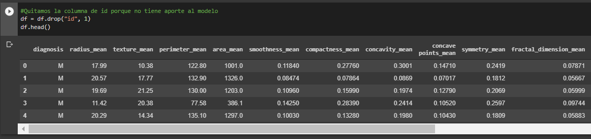

Ademas, convertimos las variables dependientes a categoricas numéricas, donde 1 son los pacientes que tienen cáncer y 0 los que no:
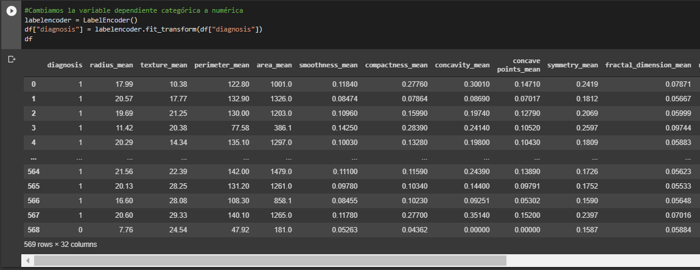

Ahora, seleccionamos las variables dependientes; es decir, las que acabamos de convertir, y las guardamos en **y**:
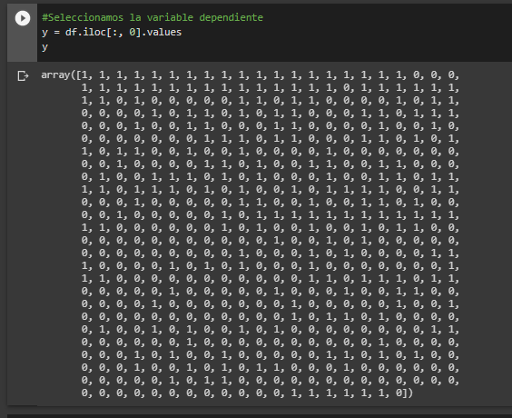

Y en seguida, guardamos las variables independientes en **X**:
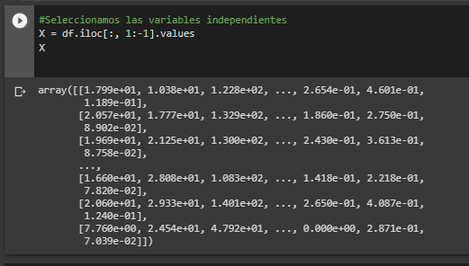

Lo siguiente es partir la data en datos de entrenamiento y datos de prueba. Estandarizamos los datos independientes y almacenamos las variables de los datos independientes en caso de necesitarlas. Despues realizamos una **reducción de dimensiones** en la data independiente con PCA:
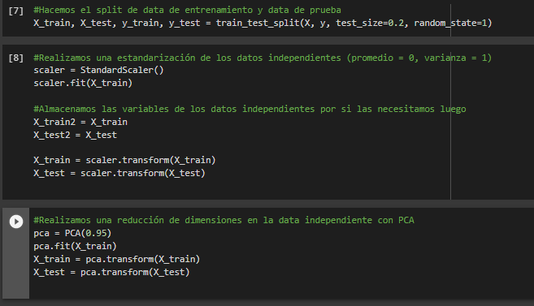

EL siguiente paso es **crear los modelos a comparar**: Logistic Regression, Linear Discriminant Analysis, K Neighbors Classifier, Decision Tree Clasifier, Random Forest Clasifier, Gaussian NB y SVC:
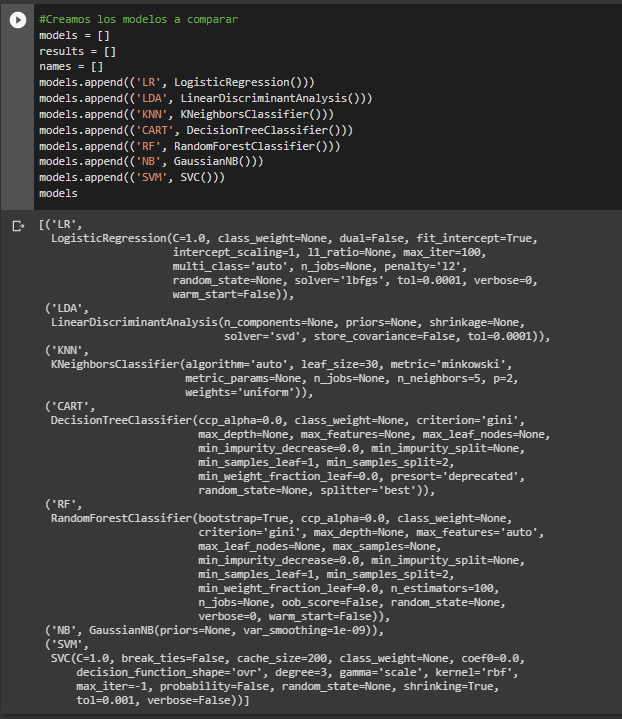

Para realizar **Grid search** creamos un listado con los posibles hiperparámetros:
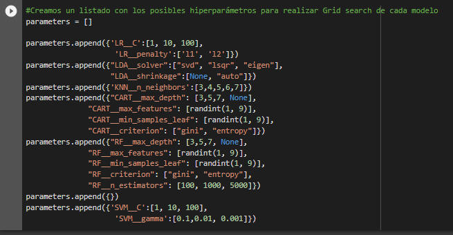

Despues tenemos que realizar un **pipeline** para afinar los hiperparámetros con grid search:
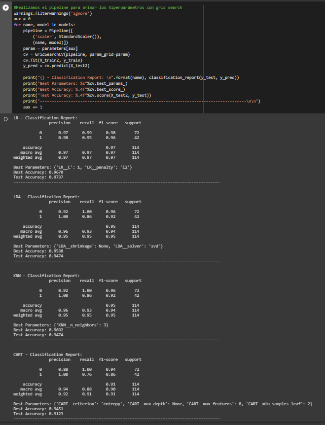

Y ahora creamos los modelos con los hiperparámetros afinados:
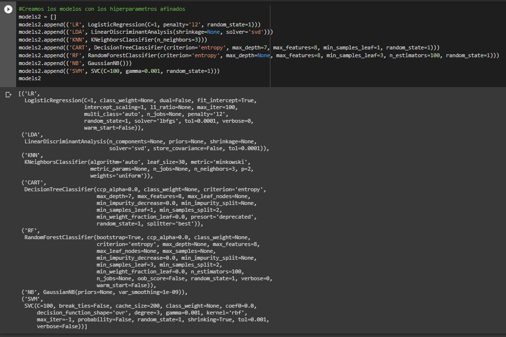

Para ver cuál es el mejor modelo realizamos un **cross validation** de todos los modelos:
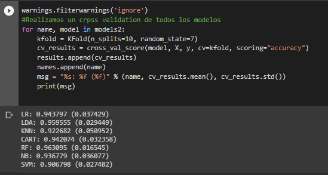

Para una mejor visualización comparamos los métodos con un **box-plot**:
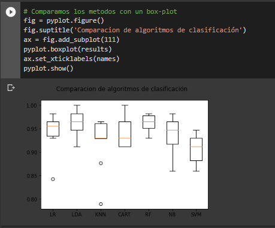

Debido a que el mejor modelo resultante es **Random Forest** creamos el Random Forest Classifier. Creamos la matriz de confusión y obtenemos el puntaje de precisión:\
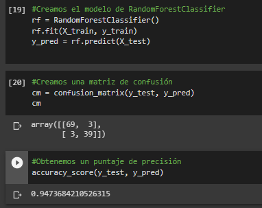

Finalmente, realizamos un benchmark entre la curva **ROC** y **AUC**:
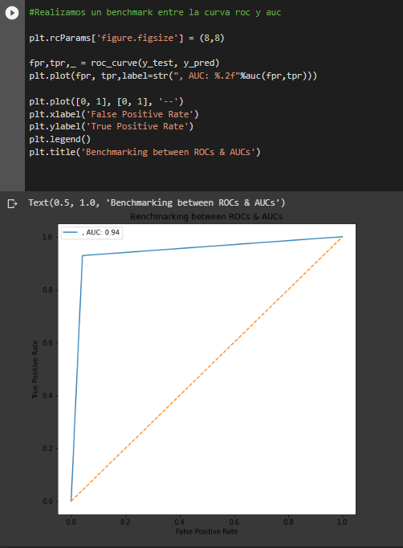
