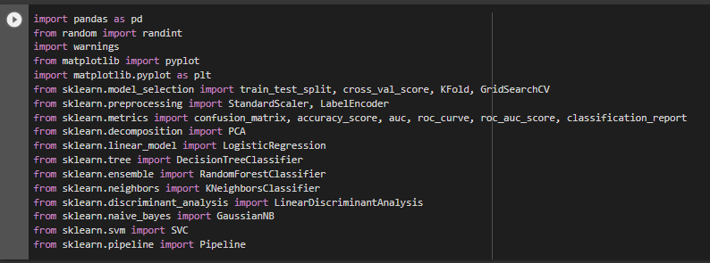
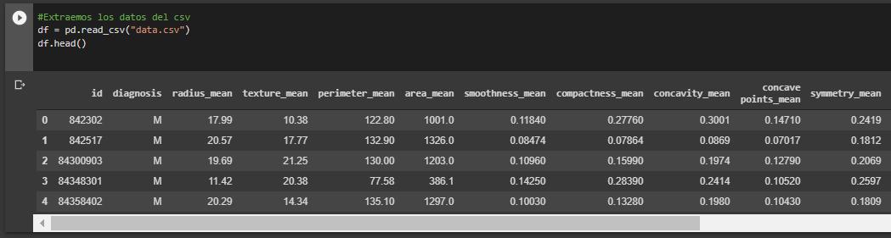

# Reconocimiento de Cancer de Mama haciendo uso de herramientas analiticas

En el presente trabajo hemos realizado un codigo en python que permita detectar cáncer de mama a partir de datos de un archivo CSV.\
En primer lugar, se imporaron las herramientas de análisis, entre las cuales se destacan pandas, los modelos de clasificacion y pipeline:

Seguidamente, extrajimos los datos del csv, los datos que aparecen son: id, diagnosis, radius_mean, texture_mean, perimeter_mean, area_mean, smoothness_mean, compactness_mean, concavity_mean, concave points_mean, symmetry_mean, fractal_dimension_mean, radius_se, texture_se, perimeter_se, area_se, smoothness_se, compactness_se, concavity_se, concave_points_se, symmetry_se, fractal_dimension_se, radius_worst, texture_worst, perimeter_worst, area_worst, smoothness_worst, compactness_worst, concavity_worst, concave_points_worst, symmetry_worst, fractal_dimension_worst, Unnamed:

